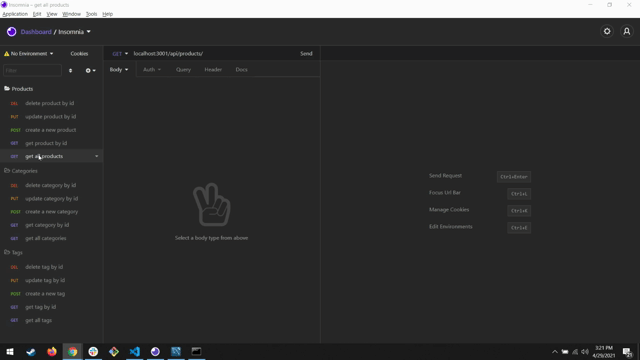

[](https://opensource.org/licenses/MIT)

# E-Commerce Back End

## Description

Back end application that performs RESTful CRUD operations to create, read, update, and delete products, categories, and tags. This Express.js API uses Sequelize to interact with a MySQL database.

## Table of Contents

- [Installation](#installation)
- [Usage](#usage)
- [Contributing](#Contributing)
- [Questions](#Questions)
- [License](#License)

## Installation
Clone repo and install dependencies:
```
git clone https://github.com/comatosino/e-commerce-back-end.git
npm i
```
Create database:
```
mysql -root -p         
Enter password: ******** // module will prompt for password
source db/schema.sql     // drops and creates ecommerce_db
exit 
```
Populate database with seed data (if needed):
```
npm run seed
```

## Usage

NOTE: This application uses the Dotenv module to load environment variables from a .env file.

To use, create a .env file in the root folder and populate it as below:
```
DB_USER='YOUR USERNAME'
DB_PW='YOUR PASSWORD'
DB_NAME='ecommerce_db'
```

To run:
```
npm start
```
with Nodemon:
```
npm run watch
```
Click the gif below for a video demo!

[](https://drive.google.com/file/d/1eCx1ITDIWLTwsx-tIBMbdGKAru4zVH19/view)

## Contributing

To contribute, contact me via one of the links below!

## Questions

Questions? Reach out to me:

GitHub: [comatosino](https://github.com/comatosino)

Email: adamsiii.robert@gmail.com

## License
    
This project is covered under the [MIT](https://opensource.org/licenses/MIT) license.
    

